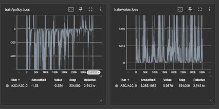

https://github.com/user-attachments/assets/7e612c94-6702-4da1-a9fe-5

https://github.com/user-attachments/assets/df22537a-9799-486b-8714-147b0a9ce1cf

https://github.com/user-attachments/assets/b766becf-ca42-45a5-a210-756747cb58a1

**ESCAPE THE BULLET**

A GAME AUTOMATION USING RL

**GLANCE**

level-1.0 (single bullet , specific direction)   level-1.1(single bullet , random direction) level-1.2(3 bullets)

level-2 ( 3bullets + shoot) 

**contribution**

game and train vamsi , env-vanshika for  level-1.0,1.2 game and train vanshika , env-vanshika for level-1.1 level-2 vamsi (A2C),  level-2(PPO)- vanshika

[**git hub link**](https://github.com/sunkustar/ESCAPE-THE-BULLET)

<https://github.com/sunkustar/ESCAPE-THE-BULLET>

BY 

VAMSI KRISHNA (12141630) VANSHIKA (12141720)

**level-1**

the bullet keeps  reflecting in 45  degrees angle the drone has to escape from the bullet

**env**

game dynamics

bullet speed 30

bullet angle 45

drone speed 10

field size(1920x1080)

ENV

observation space  -> Multidiscrete 4d ( drone x,y , bullet x,y) action space -> Multidiscret(4)( up,down, right ,left)

rewards

passive rewards for staying alive

reward averaged from distance between drone and bullet huge negative reward on crossing boundaries

big negative apon death

**Training**

we have created environment in gymanasium and used stablebaseline3 for training .

` `we tried A2C and PPO algorithms as they are suitable for  multidiscrete and box space types

logs are in logs folder 

**Observation**

the drone found lattice points in the field which cant be reached by bullet for long time

`           `**Note**

env in env.py

algorithm code in model.py

test run in test.py

load model and run load.py

tensorboard logs in logs

one demo video

in respective folders in model folder in github

**level-1 (direction)**

the bullet keeps  reflecting in random   angle the drone has to escape from the bullet

**env**

game dynamics

bullet speed 30

bullet angle random drone speed 10

field size(1920x1080)

ENV

observation space  -> Multidiscrete 4d ( drone x,y , bullet x,y) action space -> Multidiscret(4)( up,down, right ,left)

rewards

passive rewards for staying alive

reward averaged from distance between drone and bullet huge negative reward on crossing boundaries

big negative apon death

**Training**

we have created environment in gymanasium and used stablebaseline3 for training .

` `we tried A2C and PPO algorithms as they are suitable for  multidiscrete and box space types

logs are in logs folder 

**Observation**

the drone wasnt able to survive very long like before but it indeed leanrt good lattice points for many angles.

`           `**Note**

env in env.py

algorithm code in model.py

test run in test.py

load model and run load.py

tensorboard logs in logs

one demo video

in respective folders in model folder in github

**level-1 (3 bullets)**

the bullet keeps  reflecting in 45  degrees angle the drone has to escape from the bullet

**env**

game dynamics

bullet speed 30 and 3 bullets at once bullet angle 45,135,45

drone speed 10

field size(800\*600) to reduce state space

ENV

observation space  -> Multidiscrete 10d ( drone x,y , bullet x,y) action space -> Multidiscret(36,36)( movement,shoot angle)

rewards

` `positive reward for killing the bullet high positive for killing all bullets negative reward for dying

huge negative reward for out of boundary

termination -> upon death , upon killing all 3 bullets

**Training**

we have created environment in gymanasium and used stablebaseline3 for training .

` `we tried A2C and PPO algorithms as they are suitable for  multidiscrete and box space types

logs are in logs folder 

**Observation**

the drone is perfoming optimally good escaping within the gaps

`           `**Note**

env in env.py

algorithm code in model.py

test run in test.py

load model and run load.py

tensorboard logs in logs

one demo video

in respective folders in model folder in github

**level-2 (3 bullets, shoot)**

the bullets keeps  reflecting in 45  degrees angle the drone has to escape from the bullet if they hit by red bullet they passout 

**env**

game dynamics

bullet speed 30 and 3 bullets at once bullet angle 45,135,45

drone speed 10

field size(960x540) to reduce state space

ENV

observation space  -> Multidiscrete 8d ( drone x,y , bullet x,y) action space -> Multidiscret(4)( up,down, right ,left)

rewards

passive rewards for staying alive

reward averaged from distance between drone and 3  bullet huge negative reward on crossing boundaries

big negative reward on getting closer to any of the bullet

big negative apon death

termination -> upon death

**Training**

we have created environment in gymanasium and used stablebaseline3 for training .

` `we tried A2C and PPO algorithms as they are suitable for  multidiscrete and box space types

logs are in logs folder 

A2C

` `

PPO 

**Observation**

though the training goes well , it needs  more time to train better

SCOPE FOR IMPROVEMENT :

1) More triaining time
1) More focus on hyperparameter tuning
1) change in shape of boundaries

[ref1]: Aspose.Words.258431a5-3ae7-4d53-992f-ad758f57c683.004.jpeg
[ref2]: Aspose.Words.258431a5-3ae7-4d53-992f-ad758f57c683.005.png
[ref3]: Aspose.Words.258431a5-3ae7-4d53-992f-ad758f57c683.008.png
